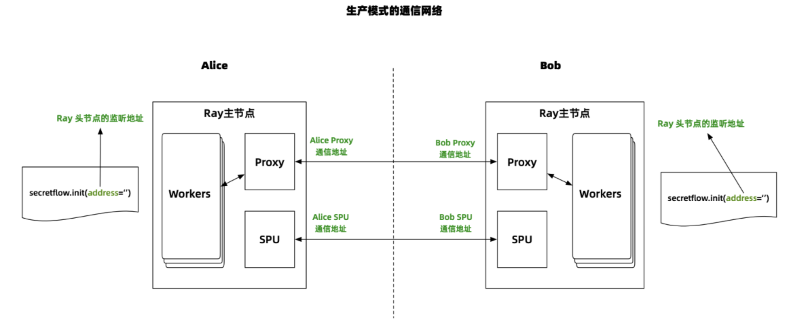
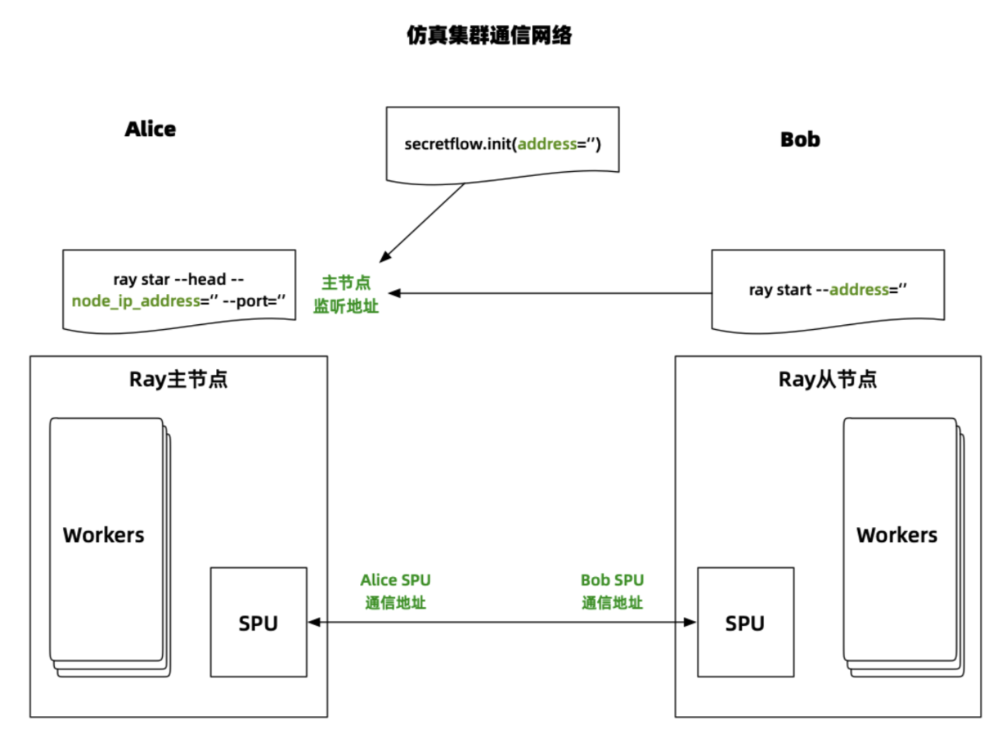
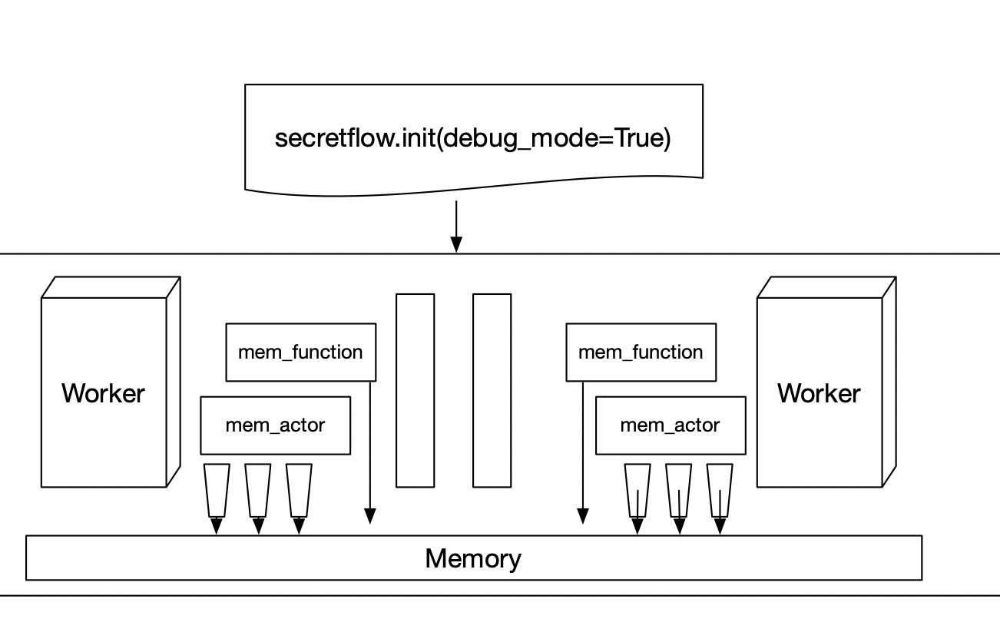
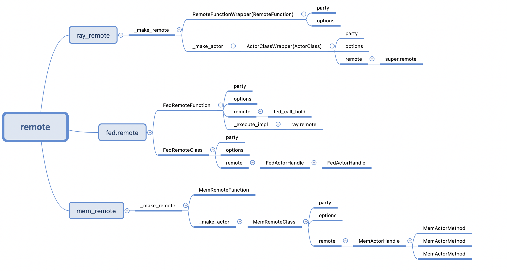

# Debug mode  介绍
隐语框架有一个很重要的特点就是:**用户只需要写一套secretflow的代码，可以在多种部署条件下直接执行！**
这意味着，用户可以使用简单易部署的方式进行开发，随后**零成本**的迁移到生产环境产生价值。
我们的隐语目前已经提供了两种模式分别是：
- Simulation mode
- Producation mode

Simulation mode 是使用单一的ray集群来进行调度，可以部署在单机上，也可以部署在多机环境，部署和使用难度都相对比较低。
Production mode 则是使用多个ray集群来进行调度，借助隐语和Ray社区合作开发的RayFed进行安全的数据交换。来解决生产环境数据安全问题。
1. simulation模式是构建在ray之上的，ray是异步lazy模式运行的，这就导致在debug的时候打印的log顺序和逻辑顺序之间不对应。
2. 而且由于ray是lazy执行的，会导致真正的错误信息会被埋没在大量的log中。淹没掉真正有效的报错信息。
3. 无法通过打断点的方式进行开发，对于各种数据结构之间的转换理解会比较困难。

通常，在引入调试模式（Debug Mode）之前，我们倾向于在模拟模式（Simulation Mode）下进行开发。然而，将模拟模式（Simulation Mode）作为开发环境时，遇到错误可能会给用户带来麻烦，ray的报错信息会掩盖掉真正的错误。
所以，从设计角度考虑，我们完善的部署模式中还缺少一种能在本地按顺序执行、能即时反馈错误、以及支持断点调试的模式。若能补充这样一种开发模式，我们的**开发**、**模拟**和**生产**环境将更为完善。因此，我们计划开发一种新的模式，称为调试模式（Debug Mode）。

## Key question
- 什么时候使用Debug Mode:
只是在代码开发阶段使用Debug Mode
- 使用Debug Mode有什么好处:
    1. 可以通过打断点的方式，快速开发排查问题；
    2. 无需启动ray，开发效率高
    3. 可以保证程序按顺序执行

- Debug Mode有什么缺点:
Debug Mode目前对spu只能做功能模拟，真正测试还是需要回到simulation模式来进行测试。


## Debug mode 设计
### 设计原则
* 上层接口依然保持和目前一致，代码不需要做任何调整。
* 提供ray和rayfed之外的第三套底层调度，采用同步模式，报错时第一时间退出。
* 可以通过打断点的方式来进行快速调试。
* 用户所有的worker不再是多进程，而是跑在一个进程里面，通信通过内存地址传递来完成。

## 实现思路
我们的调用还是通过remote来进行调用。API层保持不变。
针对内存模式重新下面的具体实现。

```python
__all__ = [
    'get',
    'kill',
    'get_distribution_mode',
    'remote',
    'set_distribution_mode',
    'shutdown',
]
```
上述这些是本次我们需要重写的接口，其中最重点的是**remote**接口。

修改后我们的部署模式为：
```python
@unique
class DISTRIBUTION_MODE(Enum):
    PRODUCTION = 1
    SIMULATION = 2
    DEBUG = 3
```

### remote模式设计
生产模式的通信网络


simulation模式的通信网络

debug模式结构

debug模式设计
secretflow的一大特点是中心化编程。我们在中心driver端会有很多调用，有些是无状态的函数调用，还有一部分是有状态的actor调用。  为了方便编程，我们在隐语中提供了proxy来对remote call进行封装。我们提供了无状态的`MemRemoteFunction`来代理函数调用。提供了`MemRemoteClass`来代理有状态的actor调用。其中需要对actor的每一个方法都封装为`MemActorMethod`并绑定到actor中。这样在driver端写代码无需考虑remote的是function还是class，可以统一行为模式。
**这些细节逻辑框架都已经通过proxy做好了，用户无需关注细节**


## 使用方法
```
debug_mode = True
```
使用方很简单就这么一条，加入到`sf.init`中就可以了。其他的框架层都已经做好了。
例子：
```python
sf.init(
        ['alice', 'bob', 'charlie'],
        debug_mode=True, # 这一条是出发debug mode的关键
    )
alice, bob, charlie = sf.PYU('alice'), sf.PYU('bob'), sf.PYU('charlie')
```

**接下来secretflow程序将会以debug mode来进行调度和运行。**

# 总结
我们为隐语提供了`DEBUG`模式，通过单机同步模式调用，来降低开发难度，提升开发效率。
三种模式在api层都为用户提供了统一的接口，可以实现一套代码无缝切换在不同的模式上。


### 实践建议：
1. 在开发过程中使用debug mode进行开发，可以在程序中通过断点来进行开发调试。
2. 在debug模式开发完成后，使用simulation模式或者production模式来进行验证，一般在这个阶段只需要解决配置问题。
3. 如果代码中有spu相关内容，由于spu的运行模式和同步模式不兼容，debug模式使用pyu进行了功能模拟，**请务必使用simulation模式进行验证**
欢迎大家尝试使用debug模式来开发，如果你想要更深入的学习，可以参考我们的源码进行学习，有问题Issue区进行交流。